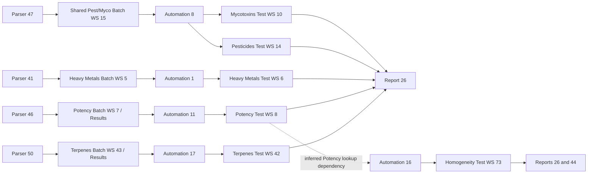

# QBench Dependency Map — 2026-08-16 Production Snapshot

## Evidence and interpretation boundary

This map is an offline reconciliation of tracked, sanitized Phase 1–5 evidence. It did not reopen QBench, execute a parser or automation, generate a report, or inspect an operational record. Relationships use four labels:

- **Directly observed** — explicit current production configuration captured in an inventory.
- **Source-observed** — explicit behavior in the sanitized parser or report source.
- **Repository evidence** — relationship present only in a historical tracked native worksheet export.
- **Reasoned inference** — a cross-object join supported by compatible current configuration, but not exercised.

Names alone do not create dependency edges. Empty fields and unavailable read-only controls are recorded as gaps, not as proof that a relationship does not exist.

## Normalized relationship counts

| Relationship | Count | Evidence |
|---|---:|---|
| Assay → Test worksheet | 18 | Directly observed assay fields |
| Assay → Batch worksheet | 17 | Directly observed assay fields |
| Assay → explicit Batch/Test protocol | 12 | Directly observed assay fields |
| Panel → assay membership | 88 | Directly observed panel detail rows |
| Protocol → ordered step assignment | 118 | Directly observed protocol detail rows |
| Protocol-step definition → worksheet | 80 | Directly observed step definitions; one of 81 steps has no worksheet |
| Assay → resource group | 9 | Directly observed assay fields |
| Assay → Batch control group | 0 | All 20 captured fields were null/blank |
| Control group → control | 4 | Directly observed group detail rows |
| Resource group → inventory item | 105 | Directly observed membership rows |
| Resource group → equipment | 137 | Directly observed membership rows |
| Parser → explicitly configured assay | 6 | Directly observed parser settings |
| Automation condition / action rows | 18 / 90 | Directly observed automation configuration |
| Report source → current assay ID route | 18 | Source-observed: report 26 has 16 current assay IDs; report 44 has 2 |
| Current KV-store assignment edge | 0 confirmed | Assignment controls/current worksheet definitions were not exposed |
| Historical KV-store → worksheet candidate | 23 | Repository evidence only |

The machine-readable counterpart is `dependency_graph.json`. Row-level sources remain authoritative when this summary and an inventory differ.

`Protocols/protocol_step_relationships.csv` has 120 physical data rows because it preserves one blank step placeholder for each empty protocol (5 and 9); 118 rows contain an actual ordered step assignment.

## Active and enabled analytical data paths

Parser-to-Batch and automation-to-Test joins in this diagram are cross-object reconciliations. The parser setting supplies the assay/target family, the assay supplies the worksheet ID, and the automation supplies the watched worksheet and destinations. They are strong reasoned dependencies unless the parser source itself names the dynamic `Results` tab. No path was executed.

| Assay path | Upstream input | Batch/trigger surface | Test/output surface | Report | Status and key caveat |
|---|---|---|---|---|---|
| Cannabinoid Potency (2) | Parser 46, active | WS7 `Results`; automation 11 | WS8, `result_1..29` and `df` | 26; 44 also reads Potency values | Enabled; historical active exports confirm Unknown Peaks 2/3 are reversed in actions 21–22 |
| Heavy Metals (3) | Parser 41 active; 22/25 inactive alternatives | WS5; automations 1 active and 2 inactive | WS6 | 26 | Enabled through parser 41; historical active exports confirm Lead/Mercury reversal in automation 1 |
| Pesticides (4) / Mycotoxins (5) qualitative | Parser 47 is configured directly only to Pesticides | Shared WS15; automation 8 | WS14 and WS10 destinations | 26 | Enabled; Mycotoxins parser relationship is indirect through shared WS15 |
| Residual Solvents (7) | No parser configured | WS11; automation 6 | WS12 | 26 | Enabled automation path; historical active exports show a 17-source/19-destination width mismatch |
| Terpenes (8) | Parser 50, active | WS43 dynamic `Results`; automation 17 | WS42, 26 fields | 26 | Enabled; protocol 9 is empty and assay 8 has no protocol/resource-group assignment |
| Water Activity (9) | No parser configured | WS29; automation 4 | WS28 | 26 summary route | Enabled automation path; automations 5 and 15 are inactive |
| Homogeneity (11) | `Potency Results Lookup` implies an upstream Potency-data dependency; its feeder was not exposed | Test status transition; automation 16 | WS73 `mg_serving_1` | 26 and 44 | Status-gated; runtime ordering and missing-value behavior were not tested |
| Aspergillus (14) | No parser directly configured | WS80; automation 9 | WS81 | 26 | Enabled automation path |
| Salmonella (15) / STEC (16) | No parser directly configured | Shared WS82; automation 12 | WS83 and WS84 | 26 | Enabled automation path |
| Listeria (17) | No parser directly configured | WS86; automation 13 | WS87 | 26 | Enabled automation path; semantic protocol 15 is not assigned on the assay |
| Aerobic / Enterobacteriaceae / Yeast and Mold (18–20) | No parser directly configured | WS89; automation 14 | WS93/95 and `ym_results` destination | 26 | IDs 18 and 20 bind WS89; assay 19 instead binds B94, so its automation relationship is unresolved |
| Pesticides Quantitative Flower (21) | No parser configured | WS13; automation 10 | WS16 | Not routed by report 26 | Enabled automation; destination `pest_quantitative_results` is absent from the last tracked export |

Two active automation paths do not reconcile to a current assay Batch binding: automation 3 watches quantitative Mycotoxin WS9 while assay 5 uses WS15/protocol 7, and automation 14 watches WS89 while assay 19 uses B94. These remain configuration gaps rather than inferred corrections.

## Protocol dependencies

Fifteen protocols contain 118 ordered assignments across 75 of 81 step definitions. Protocols 5 and 9 are empty. Steps 20, 21, 53, and 74–76 are orphan definitions. Protocol active state, required/optional state, entry/completion conditions, required role, equipment/resource/inventory assignments, and worksheet version pinning were not exposed.

Cannabinoid Potency protocol 4 is the most complete visible structural model for a future Terpenes protocol, but it is not a complete gold standard:

- worksheets 32–38 and general worksheet 40 are assigned;
- active calculation/reporting worksheet 39 and its step 21 are unassigned;
- duplicate Quality Control step 20 points to worksheet 38 but is unassigned;
- patch steps 74–76 and worksheets 140–142 are unassigned;
- final-review worksheet 41 is assigned but has zero versions; and
- current worksheet definitions were not exported.

The exact ordered maps, complete 32–40 version lists, shared steps, and workflow diagram are in `protocol_relationship_map.md` and `QBench/PROTOCOL_INDEX.md`.

## KV-store dependencies

Eleven current stores and 13,766 ordered leaf values were captured. Current Field, Assay, Panel, Protocol, and worksheet assignment edges remain unverified because the relevant read-only controls/current native worksheet definitions were not exposed. Historical tracked exports contain 23 candidate store-to-worksheet edges across eight stores; those are repository evidence only and must not be treated as current assignments.

The most consequential historical comparisons are the current-path additions absent from July embedded snapshots, 11 Pesticides quantitative `AbamectinB1a` → `Abamectin` changes, eight microbial limit changes, and worksheet 44's empty embedded config plus legacy `mu`/`Limit of Quantification` spellings. See `kvstore_dependency_analysis.md` for the complete comparison and evidence boundary.

## Report and named-cell dependencies

- Report 26 source routes 16 current assay IDs. It renders `report_results` for eight analytical groups and uses `report_header`/`report_content` for the microbial set plus Water Activity. It also reads generic `pass_fail` and Cannabinoid THC named values.
- Report 44 directly reads Homogeneity and Potency worksheet values. It checks `homogeneity_metrc` before `pass_fail`, does not render `report_results`, and can render missing Potency numeric values as `0.0`; this conflicts with the canonical Homogeneity behavior.
- Report 20 is an inactive configuration whose internal v1 remains approved active and renders the entire Test worksheet without a named-cell restriction.
- Current range compatibility cannot be certified because all required current native worksheet exports were blocked.

See `report_dependency_map.md`, `QBench/REPORT_RENDERING_MAP.md`, and `QBench/NAMED_CELL_INDEX.md` for source-level and historical-range detail.

## Control and resource dependencies

No direct assay-side Batch Control Group assignment was exposed. The four controls remain connected only to their two control groups in captured evidence. Nine direct assay-to-resource-group edges were captured; protocol-to-resource and protocol-to-control edges were not exposed and are not inferred. Resource-group membership establishes availability groupings, not actual use, calibration, stock, sufficiency, or required/optional semantics.

## Priority unresolved dependencies

1. Export current native worksheet definitions before certifying named cells, formulas, parser destinations, KV links, or version-follow behavior.
2. Reconcile protocol worksheet gaps: Heavy Metals step 27 has no worksheet, quantitative-Pesticides worksheet 151 has no active version, Cannabinoid Potency worksheet 39/step 21 is unassigned, step 20 duplicates the QC definition, patch steps 74–76 are unassigned, and final-review worksheet 41 has zero versions.
3. Reconcile confirmed automation defects in IDs 1, 6, and 11, then verify automation 10 against a current worksheet 16 export.
4. Resolve quantitative Mycotoxin WS9/protocol 8 assignment and the TYMC B94 versus automation-14 WS89 mismatch.
5. Validate report 26/44 named-cell compatibility and the Homogeneity canonical behavior in Sandbox before any production change.
6. Treat all historical KV edges as candidates until current worksheet exports or explicit assignment surfaces establish them.

No corrective configuration change was made or recommended for direct production execution by this scan.
