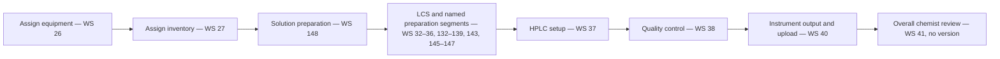

# Protocol Relationship Map — 2026-08-16

## Inventory

Fifteen protocols contain 118 ordered assignments using 75 of the 81 protocol-step definitions. Steps 20, 21, 53, 74, 75, and 76 are orphan definitions with no protocol membership. Protocols 5 and 9 are empty. Active/inactive and required/optional state were not exposed on the detail pages.

| Protocol ID | Protocol | Assigned steps | Explicit assay assignment |
|---:|---|---:|---|
| 2 | [Batch] Heavy Metals Protocol | 12 | Assay 3 |
| 3 | [Batch] Water Activity Protocol | 7 | Assay 9 |
| 4 | [Batch] Cannabinoid Potency Protocol | 24 | Assay 2 |
| 5 | [Batch] Microbials Protocol | 0 | No configured association in captured assay fields |
| 6 | [Batch] Residual Solvents Protocol | 8 | Assay 7 |
| 7 | [Batch] Qualitative Pesticides & Mycotoxin Protocol | 9 | Assays 4 and 5 |
| 8 | [Batch] Mycotoxin (Quantitative) Protocol | 10 | No configured association in captured assay fields |
| 9 | [Batch] Terpenes Protocol | 0 | No configured association in captured assay fields |
| 10 | [Test] Foreign Material Protocol | 3 | Assay 12 |
| 11 | [Batch] Homogeneity Protocol | 4 | Assay 11 |
| 12 | [Batch] Quantitative Pesticide in Cannabis Flower Protocol | 13 | Assay 21 |
| 13 | [Batch] Gene Up Salmonella & STEC Microbial Analysis | 7 | Assays 15 and 16 |
| 14 | [Batch] Gene Up Aspergillus Microbial Analysis Protocol | 8 | Assay 14 |
| 15 | [Batch] Gene Up Listeria Microbial Analysis Protocol | 7 | No configured association in captured assay fields |
| 16 | [Batch] Tempo Microbial Analysis Protocol | 6 | No configured association in captured assay fields |

## Cannabinoid Potency reconciliation

The current protocol 4 flow is:

Version-list abbreviations below are `D` = Draft, `P` = Pending, `R` = Rejected, `A` = Approved non-active, and `AA` = Approved Active.

| Worksheet | Exact current name | Type / object state | Complete visible version list | Current step / Protocol 4 sequence | Reconciliation result |
|---:|---|---|---|---|---|
| 32 | Cannabinoid Potency {Protocol WS} Preparation of Lab Control Samples | Dynamic Spreadsheet / Active | v1 D; v2 AA | Step 13 / 4 | Assigned |
| 33 | Cannabinoid Potency {Protocol WS} Preparation of Flower/Plant Samples | Dynamic Spreadsheet / Active | v1 D; v2 A; v3 A; v4 P; v5 AA | Step 14 / 5 | Assigned; historical pending v4 is older than active v5 |
| 34 | Cannabinoid Potency {Protocol WS} Preparation of Flower/Plant Samples Vortex/Sonicate | Dynamic Spreadsheet / Active | v1 D; v2 AA | Step 15 / 6 | Assigned |
| 35 | Cannabinoid Potency {Protocol WS} Preparation of Flower/Plant Samples Centrifuge | Dynamic Spreadsheet / Active | v1 D; v2 A; v3 R; v4 R; v5 A; v6 AA | Step 16 / 7 | Assigned |
| 36 | Cannabinoid Potency {Protocol WS} Preparation of Flower/Plant Samples Filter | Dynamic Spreadsheet / Active | v1 D; v2 R; v3 A; v4 A; v5 AA | Step 17 / 8 | Assigned |
| 37 | Cannabinoid Potency {Protocol WS} HPLC Setup and Measurement | Dynamic Spreadsheet / Active | v1 D; v2 AA | Step 18 / 21 | Assigned |
| 38 | Cannabinoid Potency {Protocol WS} Quality Control Requirements | Dynamic Spreadsheet / Active | v1 D; v2 A; v3 A; v4 A; v5 A; v6 AA | Step 19 / 22 | Assigned; duplicate step 20 points here but is unassigned |
| 39 | Cannabinoid Potency {Protocol WS} Calculations and Reporting of Results | Dynamic Spreadsheet / Active | v1 A; v2 R; v3 A; v4 A; v5 A; v6 A; v7 AA | Step 21 / — | **Active worksheet and defined step, but not assigned to any protocol** |
| 40 | General {Protocol WS} Instrument Output and QBench Upload of Results | Dynamic Spreadsheet / Active | v1 AA | Step 22 / 23 | Assigned shared general step; used by six protocols |

For all nine baseline worksheets, the displayed active version is the highest visible version; no newer draft or pending version follows it. Required/optional state, entry/completion conditions, required role, equipment/resource/inventory assignments, fields completed, direct automation/report bindings, and worksheet version pinning versus follow-active behavior were not exposed on the protocol-step detail pages. Parser 46, automation 11, reports 26/44, Batch worksheet 7, and Test worksheet 8 are downstream Cannabinoid Potency assay dependencies, not observed bindings to any individual protocol step. Native exports for the current active definitions remain blocked, so worksheet-internal fields and formulas were not reconstructed.

Step 20 is a second Quality Control definition pointing to worksheet 38 but is unassigned. It shares the displayed name and worksheet with assigned step 19 but has a different description/SOP-section reference. Patch steps 74–76, pointing to worksheets 140–142, are also unassigned. The assigned final review step 23 points to worksheet 41, which is active as an object but has zero versions; no versioned worksheet definition is available.

Protocol 4 is the strongest visible candidate structural reference for a future Terpenes protocol: it includes shared instruction steps for assigning equipment and inventory, solution preparation, multiple named preparation segments, dilution, instrumental measurement, quality control, result upload, and final review. This is an evidence-based inference, not a QBench-designation. The UI exposed a flat ordered list; conditional branching and required/optional behavior were not exposed. Protocol 4 is not a complete gold standard because calculations/reporting worksheet 39 is omitted and worksheet 41 has no version. Terpenes protocol 9 has no assigned steps and is not assigned on assay 8.

## Assigned-step worksheet gaps

| Scope | Gap | Impact |
|---|---|---|
| Protocol 2 sequence 5, step 27 | No worksheet assigned to the step | Heavy Metals digestion instructions/data capture cannot be verified at the worksheet layer |
| Step 23 / worksheet 41 in 12 protocols | Worksheet object is Active but has zero versions and no active version | The shared final-review step has no versioned worksheet definition |
| Protocol 12 sequence 4, step 83 / worksheet 151 | Worksheet object is Active, but its sole v1 is Draft and no version is active | The configured quantitative-Pesticides step cannot resolve to an active worksheet version from captured metadata |

No other assigned step points to an inactive worksheet object, a missing worksheet object, or a worksheet without an active version. Separately, the six unassigned step definitions are 20, 21, 53, and 74–76.

## Shared general steps

- Step 11 / worksheet 26 assigns equipment and is used by 12 protocols.
- Step 12 / worksheet 27 assigns inventory and is used by 11 protocols.
- Step 22 / worksheet 40 handles instrument output and QBench upload and is used by six protocols.
- Step 23 / worksheet 41 is the overall chemist review and is used by 12 protocols, but worksheet 41 has no version.

## Equipment, inventory, and resource assignment boundary

| Surface | Captured state | Interpretation |
|---|---|---|
| 81 protocol-step definitions | Equipment assignment, inventory assignment, and resource assignment fields all `not_exposed` | No item-, equipment-, or resource-group edge can be asserted at protocol-step level |
| Step 11 / worksheet 26 | Named `Assigning Equipment Usage to Batch`; 12 protocol memberships | Instruction/workflow dependency only; not evidence of a configured equipment assignment |
| Step 12 / worksheet 27 | Named `Assigning Inventory Usage to Batch`; 11 protocol memberships | Instruction/workflow dependency only; not evidence of a configured inventory assignment |
| Nine assay-to-resource-group rows | Explicit assay-side Batch/Test resource-group links | Assay context only; not protocol assignment |
| Four controls / two control groups | No protocol reference exposed | No protocol-to-control edge established |

All protocol-step worksheet versions remain subject to the Phase 2 native Export Spreadsheet blocker. No worksheet-version pinning or follow-active behavior was exposed on protocol-step detail pages.
